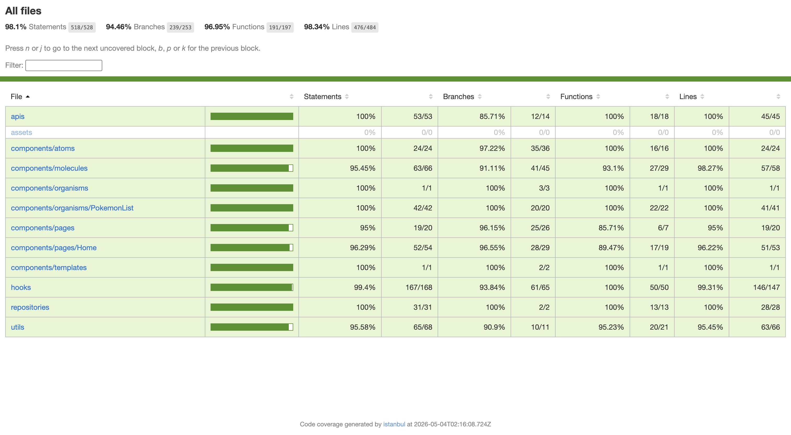
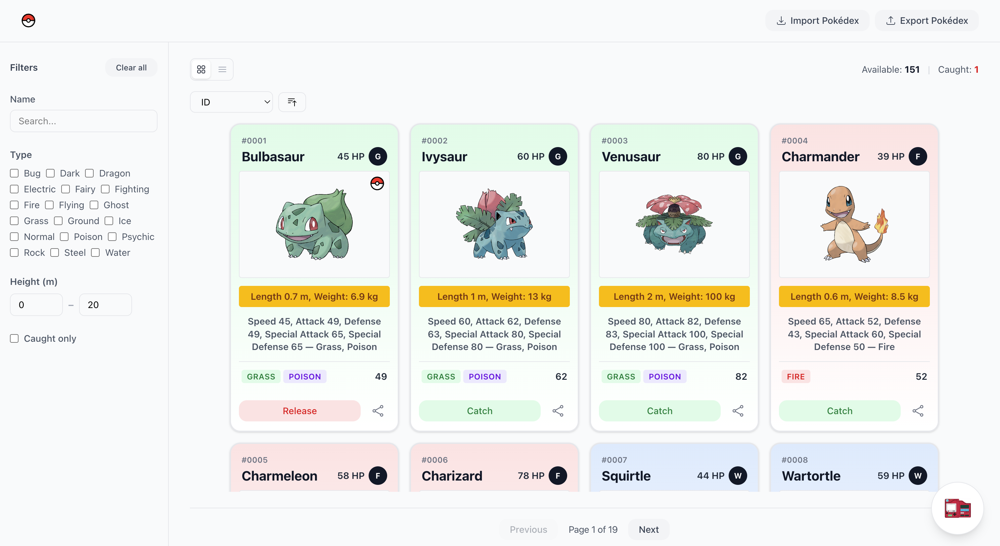
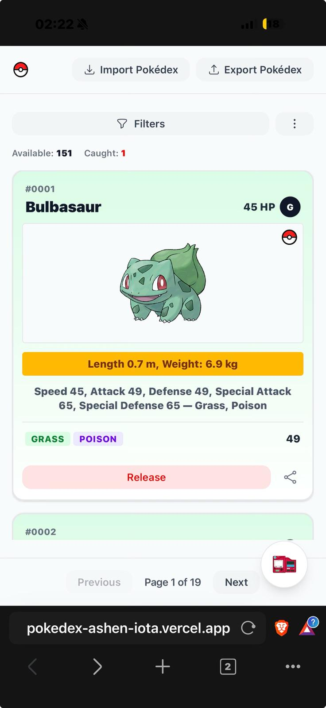
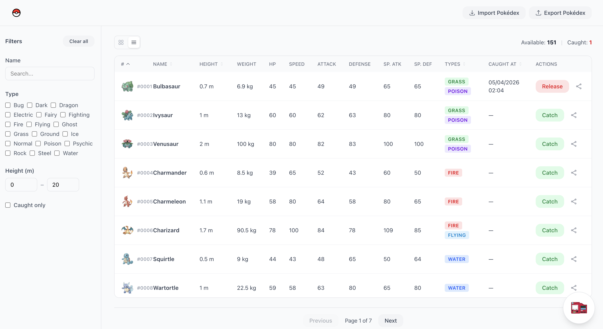
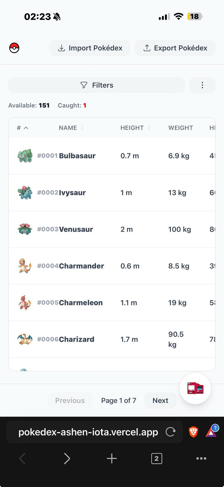
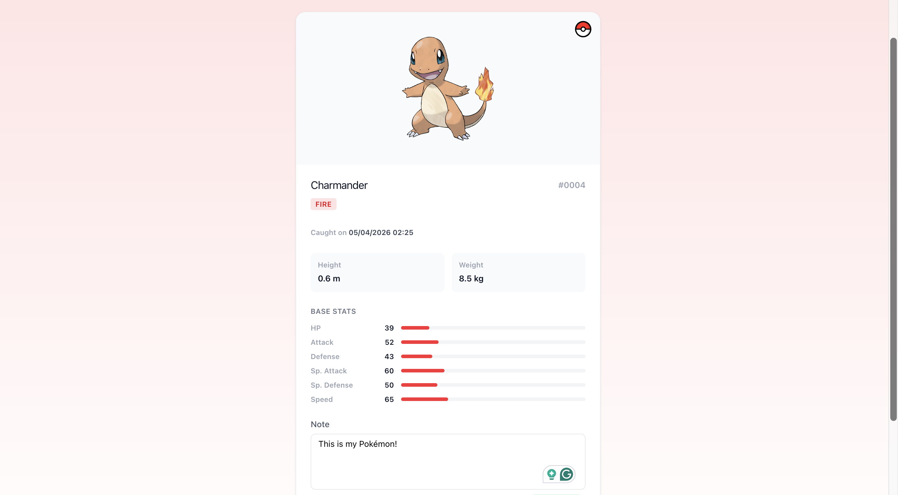
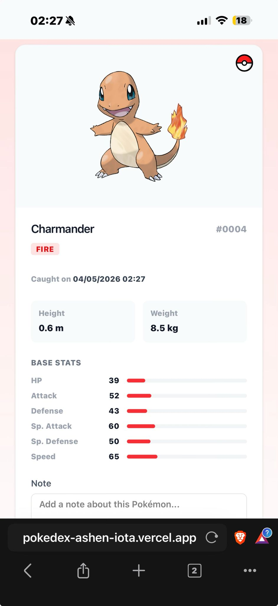
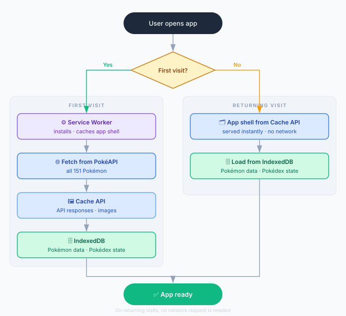

# Pokédex — Frontend Engineering Challenge

A production-ready Pokédex application for tracking Generation I Pokémon. Built with React 19, TypeScript, and Vite.

**Live Demo:** [pokedex-ashen-iota.vercel.app](https://pokedex-ashen-iota.vercel.app/)
**Project Board:** [Trello — bloq.it Challenge](https://trello.com/b/bfqS8gDQ/bloqit-challenge)

---

## Table of Contents

- [Features](#features)
- [Tech Stack](#tech-stack)
- [Getting Started](#getting-started)
- [Architecture](#architecture)
- [Testing](#testing)
- [Code Quality](#code-quality)
- [CI/CD](#cicd)
- [Deployment](#deployment)
- [Screenshots](#screenshots)
- [SEO & Performance](#seo--performance)

---

## Features

- Browse all 151 Generation I Pokémon with grid and table views
- Mark Pokémon as caught/uncaught and track overall progress
- View detailed stats: HP, Attack, Defense, Speed, Sp. Attack, Sp. Defense, type(s), height, weight, and date added
- Filter and sort by name, height, type, and timestamp
- Bulk-select and delete multiple Pokémon
- Attach personal notes to any Pokémon
- Share Pokémon details via the Web Share API
- Export and import your Pokédex as CSV
- Offline support via Service Worker and IndexedDB caching (PWA)

---

## Tech Stack

| Category       | Library / Tool                |
| -------------- | ----------------------------- |
| UI Framework   | React 19                      |
| Language       | TypeScript 6                  |
| Build Tool     | Vite 8 + SWC                  |
| Styling        | Tailwind CSS 4                |
| Routing        | React Router 7                |
| PokéAPI Client | pokedex-promise-v2            |
| Icons          | Heroicons                     |
| Testing        | Vitest + Testing Library      |
| Linting        | ESLint 10 + TypeScript ESLint |
| Formatting     | Prettier 3                    |
| Git Hooks      | Husky 9                       |

---

## Getting Started

### Prerequisites

- Node.js 24 or later
- npm

### Installation

```bash
# 1. Clone the repository
git clone https://github.com/WemersonPD/fe-engineering-challenge.git
cd fe-engineering-challenge

# 2. Install dependencies (Husky hooks are set up automatically via the prepare script)
npm install

# 3. Start the development server
npm run dev
```

The app is now running at `http://localhost:5173`.

### Available Scripts

| Script                  | Description                                          |
| ----------------------- | ---------------------------------------------------- |
| `npm run dev`           | Start the Vite development server with HMR           |
| `npm run build`         | Type-check and produce an optimised production build |
| `npm run preview`       | Serve the production build locally                   |
| `npm run lint`          | Run ESLint across all source files                   |
| `npm run format`        | Format all TypeScript files with Prettier            |
| `npm run test`          | Run the full unit test suite with Vitest             |
| `npm run test:coverage` | Run tests and generate a coverage report             |

---

## Architecture

### Atomic Design

Components are organised following the Atomic Design methodology, which creates a clear hierarchy from primitive elements to complete pages.

```
src/
├── components/
│   ├── atoms/          # Primitive UI elements: Button, Badge, Input, Checkbox, Dropdown, …
│   ├── molecules/      # Composed atoms: Card, Pagination, Table, ListToolbar, NoteForm, …
│   ├── organisms/      # Feature-level sections: PokemonList, FilterPanel, Sidebar
│   ├── pages/          # Route-level views: Home, PokemonDetails
│   └── templates/      # Layout wrappers: HomeLayout
├── hooks/              # Custom React hooks (data fetching, state, utilities)
├── apis/               # External integrations (PokéAPI, IndexedDB)
├── repositories/       # Data-access layer that abstracts the API and cache
├── services/           # Business logic decoupled from UI
├── utils/              # Pure utility functions (CSV, date, class names, …)
└── types/              # Shared TypeScript type definitions
```

### Data Flow

```
PokéAPI (pokedex-promise-v2)
        │
        ▼
   apis/pokemonAPI.ts        ← thin wrapper around the third-party client
        │
        ▼
   apis/indexedDB.ts         ← IndexedDB read/write for offline caching
        │
        ▼
 repositories/pokemon.repository.ts   ← orchestrates API + cache, exposes clean methods
        │
        ▼
  hooks/ (usePokedex, usePokemon, useAllPokemon, …)   ← React state management
        │
        ▼
   organisms / pages         ← render layer, receives data as props
```

The repository layer ensures that UI components never talk directly to the API or the cache, making both easy to swap or test in isolation.

### Routing

Two routes are registered in `App.tsx` via React Router 7:

| Path           | Component        | Description                                            |
| -------------- | ---------------- | ------------------------------------------------------ |
| `/`            | `Home`           | Pokédex list with filtering, sorting, and bulk actions |
| `/pokemon/:id` | `PokemonDetails` | Full stats and notes for a single Pokémon              |

---

## Testing

Tests are colocated with their components and use **Vitest** with **@testing-library/react**.

### Running tests

```bash
# Run tests once
npm run test

# Run with coverage report (html, lcov, text)
npm run test:coverage
```

Coverage reports are written to `coverage/` and thresholds are enforced at **80%** for lines, functions, branches, and statements (configured in `vite.config.ts`).



### Test conventions

- Snapshot tests verify that a component renders without crashing.
- Behavioural tests use `@testing-library/react` queries and `userEvent` to simulate real interactions.
- Mocks use `mockResolvedValueOnce` / `mockReturnValueOnce` (never persistent variants) to prevent state leakage between tests.
- The test environment is `jsdom` with `@testing-library/jest-dom` matchers available globally.

---

## Code Quality

### ESLint

ESLint is configured in `eslint.config.js` with:

- `typescript-eslint` recommended rules
- `eslint-plugin-react-hooks` for hooks rules
- `eslint-config-prettier` to avoid conflicts with Prettier

```bash
npm run lint
```

### Prettier

Formatting is enforced via `.prettierrc`:

- No semicolons
- Single quotes
- Trailing commas everywhere
- 80-character print width

```bash
npm run format
```

### Husky Git Hooks

Husky prevents bad code from reaching the remote by running checks automatically on every commit and push.

| Hook         | Commands                                          |
| ------------ | ------------------------------------------------- |
| `pre-commit` | `npm run lint` → `npm run build`                  |
| `pre-push`   | `npm run lint` → `npm run build` → `npm run test` |

If any step fails, the operation is aborted until the issue is resolved.

---

## CI/CD

### Continuous Integration — GitHub Actions

Every pull request targeting `main` triggers the `CI` workflow (`.github/workflows/ci.yml`):

```
Pull Request → main
      │
      ├── Checkout code
      ├── Setup Node 24 (with npm cache)
      ├── npm ci
      ├── npm run lint
      ├── npm run test
      └── npm run build
```

All steps must pass before a PR can be merged. This mirrors the pre-push hook locally so there are no surprises in CI.

### Continuous Deployment — Vercel

Deployments are managed by **Vercel** and are fully automatic:

| Event           | Environment | URL                                                                     |
| --------------- | ----------- | ----------------------------------------------------------------------- |
| Merge to `main` | Production  | [pokedex-ashen-iota.vercel.app](https://pokedex-ashen-iota.vercel.app/) |
| Pull Request    | Preview     | Unique URL per PR (posted as a PR comment)                              |

Vercel builds the project by running `npm run build` and serves the `dist/` output as a static site. No additional configuration is required.

---

## Screenshots

> Screenshots captured from the live deployment at [pokedex-ashen-iota.vercel.app](https://pokedex-ashen-iota.vercel.app/).

### Grid View

| Desktop                                                             | Mobile                                                             |
| ------------------------------------------------------------------- | ------------------------------------------------------------------ |
|  |  |

### Table View

| Desktop                                                               | Mobile                                                               |
| --------------------------------------------------------------------- | -------------------------------------------------------------------- |
|  |  |

### Pokémon Details

| Desktop                                                                 | Mobile                                                                 |
| ----------------------------------------------------------------------- | ---------------------------------------------------------------------- |
|  |  |

### Offline / PWA

The app is installable as a Progressive Web App and works fully offline via three layers:

- **Service Worker (`public/sw.js`)** — registers on first open and pre-caches the app shell. All subsequent visits are served from cache, even with no network.
- **Cache API** — PokéAPI responses and Pokémon images are cached on first fetch using a cache-first strategy, preserving the full visual experience offline.
- **IndexedDB (`apis/indexedDB.ts`)** — two stores: Pokémon data (stats, types, etc.) so the repository never hits the network twice for the same Pokémon, and the user's Pokédex state (caught status, notes, timestamps) which is stored locally and never leaves the device.



---

## SEO & Performance

Lighthouse audits were run against the production deployment for both desktop and mobile.

- [SEO report — Desktop](docs/reports/Seo_Pokedex.pdf)
- [SEO report — Mobile](docs/reports/Seo_Pokedex_Mobile.pdf)
